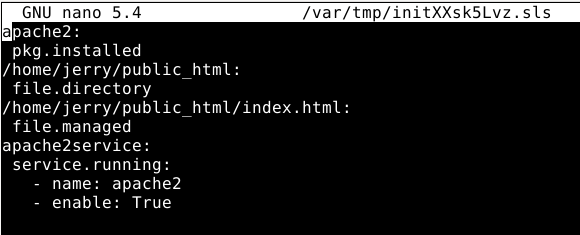
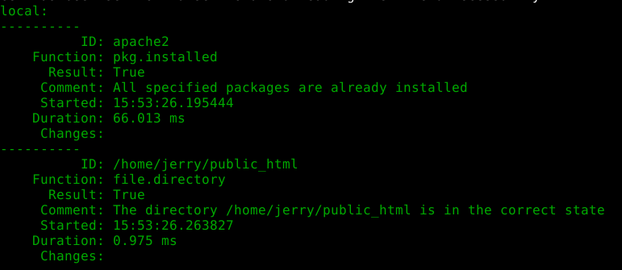
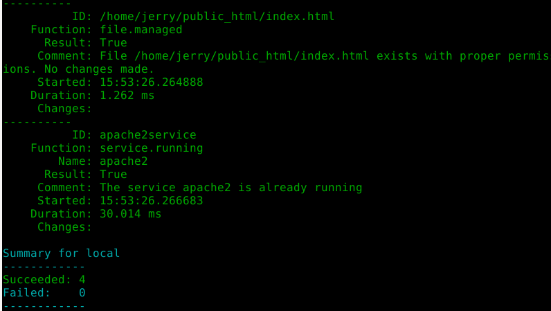
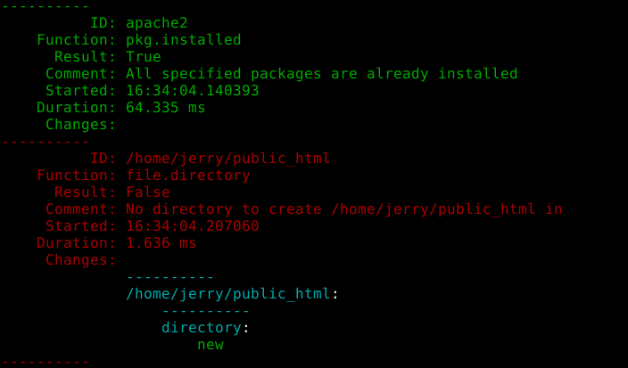
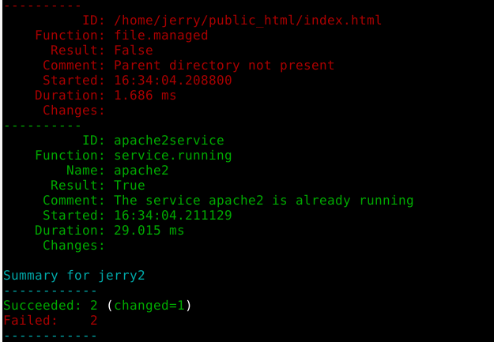
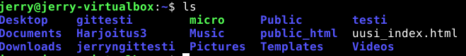
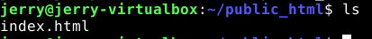

# h3 Versionhallinta

z) Tämä tehtävä on tehty omalla pöytäkoneellani VM VirtualBoxissa Debian
   11.3-käyttöjärjestelmässä. 

## Commonmark contributors: Markdown Reference

*  Kerrotaan hyödyllisistä merkeistä, joita voi käyttää Markdown teksti-
   formaatissa eli .md-tiedostoissa, jotta saadaan aseteltua teksti
   paremmin luettavaan muotoon.
*  Tutoriaali, jossa kokeillaan, mitä eri merkit tekevät, tässä muutama
   esimerkki:
*  /# = Otsikko 1
*  /##  = Otsikko 2
*  [linkki](linkin osoite)
*  
*  Kappalejako = yksi tyhjä rivi tekstin väliin
*  Tab = sisentää koodia, jolloin se tulee näkyviin palikan sisään
*  Tähtiä allekkain = lista palloilla
*  Numeroita allekkain = lista numeroilla 

a) Tämä tiedosto on Markdown-tiedosto, joka löytyy GitHub-varastosta
   Harjoitus 3. 

b) Loin 5 uutta tiedostoa, jotka vein samalla kertaa git-varastooni 
   (kuva 1) komennoilla `git add .` , `git commit` ja `git pull` ja `git push`.
   Commit messageksi laitoin "Add fifth version of harjoitus3 and add 5	
   new configuration files", koska tämä oli viides viemäni  versio 
   harjoitus3:sta ja vein 5 kuvitteellista "konfiguraatiotiedostoa" 
   varastoon. Komennolla `git show` pystyin katsomaan, mitä on tiedostoissa on
   viimeksi muokattu (kuva 2). Tämän jälkeen tein tiedostojen sisältöön 
   muutoksia, ja vein ne uudestaan samaan aikaan samoilla komennoilla 
   git-varastoon, ja `git commit` näytti tältä:(kuva 3) 

 

   Kuva 1

   Kuva 2

   Kuva 3

c) Kansiossa Harjoitus3 komento `git log` tulostaa seuraavat tiedot:(kuva 4) 

   Kuva 4

   Näistä tiedoista nähdään, kuka tiedostoa on muokannut, milloin ja mikä on 
   ollut git commit-viesti.

   Komento `git diff` ei yksinään aiheuttanut mitään, mutta tutkittuani asiaa,
   löysin Career Karma -sivuston artikkelista Git Diff: A How-To Guide eri
   asioita, joita kyseisellä komennolla voi suorittaa. Yksi niistä oli
   kahden git commitin ID:n vertailu. Komennolla `git log --pretty=oneline`
   saatiin näkyviin eri versiot ja niiden ID:t (kuva 5).

   Kuva 5

   Komento `git diff` ja kahden eri ID:n asettaminen komennon perään näyttää
   molempien versioiden muutokset ja sisällön, jolloin voi verrata niitä 
   (kuva 6). Kuvassa näkyy punaisella vanhempi versio ja vihreällä uudempi.

   Kuva 6

   `git Blame` -komennolle löysin Atlassian Git Blame-tutoriaalista seuraavan
   käyttötarkoituksen: kun ajaa esim. `git blame harjoitus3.md` -komennon,
   tulos on seuraavanlainen: (kuva 7)

   Kuva 7

   Komento siis näyttää kaikki muutokset tietyssä tiedostossa, kuka ne on
   tehnyt milloin ne on tehty ja mitä on tehty. Git Blame-tutoriaalin mukaan
   komento on erityisen hyvä virheiden tunnistamiseen, koska sen avulla
   nähdään helposti, missä ja milloin virhe on tapahtunut.  

d) Muokkasin aiemmin luomaani tiedostoa foobar (kuva 8),johon lisäsin
   naurua. Tämän jälkeen ajoin komennon `git reset --hard HEAD` 
   (kuva 9), joka palautti tiedostojen tilan edellisen git commitin aikaiseen
   tilaan (kuva 10).

   Kuva 8

   Kuva 9

   Kuva 10 

e) Tässä tehtävässä loin salt-tilan (kuva 11) /srv/salt/jerryntila/ 
   -hakemistoon, joka asentaa Apache2:n (pkg.installed), luo public_html 
   -hakemiston käyttäjän kotihakemistoon (file.directory) ja luo kyseiseen 
   hakemistoon index.html -sivun (file.managed). Tila myös käynnistää Apache2:n
   järjestelmän käynnistyksen yhteydessä (enable: True) ja varmistaa, että 
   Apache2 on käynnissä (service.running).
  

   Kuva 11 

   Kun ajan tilan paikallisesti komennolla
   `sudo salt-call --local state.apply jerryntila`
   tulos on seuraavanlainen: (kuvat 12 ja 13)

   Kuva 12 

   Kuva 13

   Tässä tapauksessa olen ajanut komennon jo aiemmin, jolloin nämä kuvat 
   osoittavat, että tilani on idempotentti, eli komennon uudestaanajaminen
   ei muuta mitään.

   Jos haluaisin ajaa tilan orjakoneelleni komennolla
   `sudo salt '*' state.apply jerryntila` , tulos olisi seuraavanlainen:
   (kuvat 14 ja 15)

   Kuva 14  

   Kuva 15

   Tässä näemme, ettei tilaa voi ajaa orjakoneille, koska kyseistä /home/jerry/
   -hakemistoa ei ole orjakoneella. Tässä tilassa kotihakemiston kohdalle tulisi
   aina asettaa kyseisen koneen kotihakemisto, esim /home/jerry2/. Tila ei siis
   ole kovin käytännöllinen kuin vain paikallisesti, koska kotihakemisto pitää
   sijoittaa aina uudestaan.

   Tässä vielä kuvat tilan luomasta public_html -hakemistosta (kuva 16) ja
   tilan sinne luomasta index.html -tiedostosta (kuva 17). 

   Kuva 16

   Kuva 17

### Lähteet:

  z) ja a)
 
  Commonmark contributions: Markdown Reference. Luettavissa:
  https://commonmark.org/help/
  
  c)

  Gallagher, James: Git Diff: A How-To Guide. 2021. Luettavissa:
  https://careerkarma.com/blog/git-diff/

  Atlassian: Git Blame. Luettavissa:
  https://www.atlassian.com/git/tutorials/inspecting-a-repository/git-blame  

  d)

  Schkn: How to Git Reset to HEAD. Luettavissa:
  https://devconnected.com/how-to-git-reset-to-head/
 
  e)

  SaltStack: salt.states.service. 2022. Luettavissa:
  https://docs.saltproject.io/en/latest/ref/states/all/salt.states.service.html
  
  SaltStack: salt.states.pkg. 2022. Luettavissa:
  https://docs.saltproject.io/en/latest/ref/states/all/salt.states.pkg.html

  SaltStack: salt.states.file. 2022. Luettavissa: 
  https://docs.saltproject.io/en/latest/ref/states/all/salt.states.file.html
