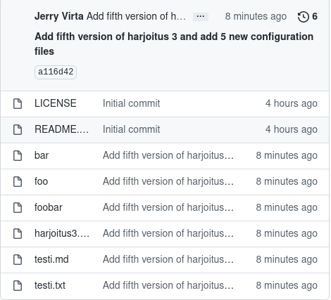

# h3 Versionhallinta

z)Tämä tehtävä on tehty omalla pöytäkoneellani VM VirtualBoxissa Debian
  11.3-käyttöjärjestelmässä. 

## Commonmark contributors: Markdown Reference

* Kerrotaan hyödyllisistä merkeistä, joita voi käyttää Markdown teksti-
  formaatissa eli .md-tiedostoissa, jotta saadaan aseteltua teksti
  paremmin luettavaan muotoon.
* Tutoriaali, jossa kokeillaan, mitä eri merkit tekevät, tässä muutama
  esimerkki:
* /# = Otsikko 1
* /##  = Otsikko 2
* [linkki](linkin osoite)
* 
* Kappalejako = yksi tyhjä rivi tekstin väliin
* Tab = sisentää koodia, jolloin se tulee näkyviin palikan sisään
* Tähtiä allekkain = lista palloilla
* Numeroita allekkain = lista numeroilla 

a)Tämä tiedosto on Markdown-tiedosto, joka löytyy GitHub-varastosta
  Harjoitus 3. 

b)Loin 5 uutta tiedostoa, jotka vein samalla kertaa git-varastooni 
  (kuva 1) komennoilla git add . , git commit ja git pull ja git push.
  Commit messageksi laitoin "Add fifth version of harjoitus3 and add 5	
  new configuration files", koska tämä oli viides viemäni  versio 
  harjoitus3:sta ja vein 5 kuvitteellista "konfiguraatiotiedostoa" 
  varastoon. Komennolla git show pystyin katsomaan, mitä on tiedostoissa on
  viimeksi muokattu (kuva 2). Tämän jälkeen tein tiedostojen sisältöön 
  muutoksia, ja vein ne uudestaan samaan aikaan samoilla komennoilla 
  git-varastoon, ja git commit näytti tältä:(kuva 3) 

 

  Kuva 1

  Kuva 2

  Kuva 3

c)Kansiossa Harjoitus3 komento git log tulostaa seuraavat tiedot:(kuva 4) 

  Kuva 4

  Näistä tiedoista nähdään, kuka tiedostoa on muokannut, milloin ja mikä on 
  ollut git commit-viesti.

  Komento git diff ei yksinään aiheuttanut mitään, mutta tutkittuani asiaa,
  löysin Career Karma -sivuston artikkelista Git Diff: A How-To Guide eri
  asioita, joita kyseisellä komennolla voi suorittaa. Yksi niistä oli
  kahden git commitin ID:n vertailu. Komennolla git log --pretty=oneline
  saatiin näkyviin eri versiot ja niiden ID:t (kuva 5).

  Kuva 5

  Komento git diff ja kahden eri ID:n laitto perään näyttää molempien 
  versioiden muutokset ja sisällön, jolloin voi verrata niitä (kuva 6).
  Kuvassa näkyy punaisella vanhempi versio ja vihreällä uudempi.

  Kuva 6

  Git Blame komennolle löysin Atlassian Git Blame-tutoriaalista seuraavan
  käyttötarkoituksen: kun ajaa esim. git blame harjoitus3.md -komennon,
  tulos on seuraavanlainen: (kuva 7)

  Kuva 7

  Komento siis näyttää kaikki muutokset tietyssä tiedostossa, kuka ne on
  tehnyt milloin ne on tehty ja mitä on tehty. Git Blame-tutoriaalin mukaan
  komento on erityisen hyvä virheitten tunnistamiseen, koska sen avulla
  nähdään helposti, missä ja milloin virhe on tapahtunut.  

d)Muokkasin aiemmin luomaani tiedostoa foobar (kuva 8),johon lisäsin
  naurua. Tämän jälkeen ajoin komennon git reset --hard HEAD (kuva 9), 
  joka palautti tiedostojen tilan edellisen git commitin aikaiseen
  tilaan (kuva 10).

  Kuva 8

  Kuva 9

  Kuva 10 
